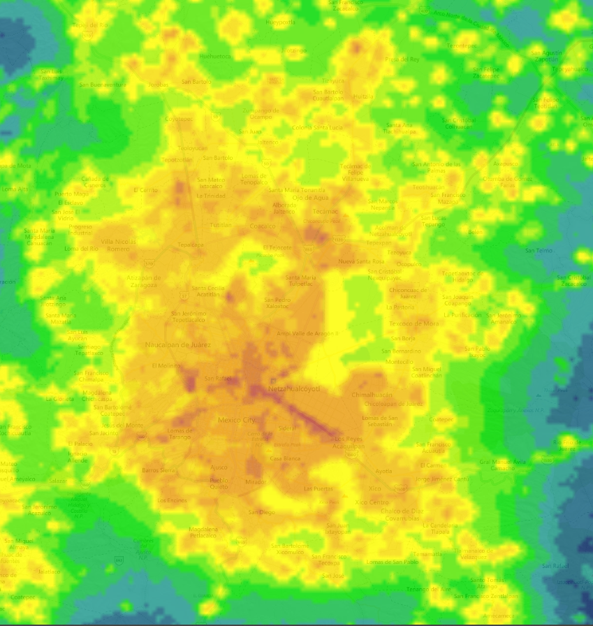

# Light-Pollution
If you want to see how light polluted is the place where you live go to: https://www.lightpollutionmap.info/. This repository helps you extract numerically the pollution of a particular place from a GeoTiff from NOAA.

## The code
This code is reduced to Mexico space, to extract data from other regions you will have to change [Light Pollution script](light_pollution_script.py) with the wanted region on: 
`latitud = []
position = 0
for i in yp:
  if i[0] >= 12.211404 and i[0] <= 32.621072:
    latitud.append(position)
    position += 1
  else:
    position += 1` 
 And: 
`longitud = []
position = 0
for i in xp[0]:
  if i >= -119.850663 and i <= -80.355462:
    longitud.append(position)
    position += 1
  else:
    position += 1` 
 Basically, you input a Geotiff and you will get a csv with latitude-longitude positions and numerical value of light pollution. Later using [Light pollution infer](light_pollution_infer.py) you can infer light pollution under latitude longitude points, since it is a continous space problem.

## More info
For more info go to [this presentation](light_pollution.pdf) where you will find te requirements to run the code.
